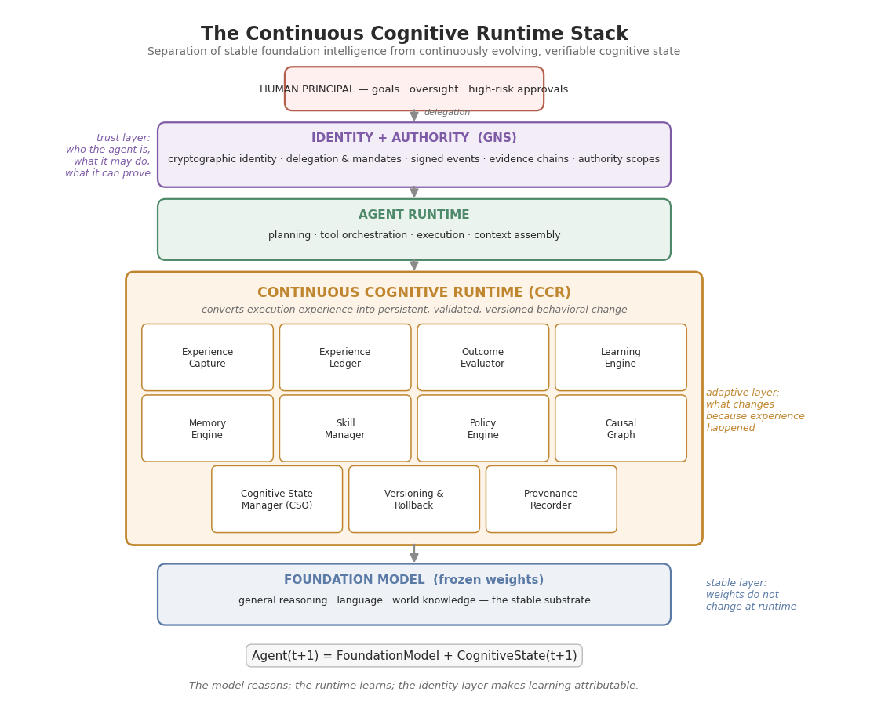

# 00 — CCR System Overview: Architecture

**Continuous Cognitive Runtime (CCR) — Document 0 of the CCR specification series**
**Status:** Working draft v0.1 — personal working document, intended for later refinement toward an arXiv publication
**Source basis:** *Continuous Cognitive Runtime (CCR) — Research & Development Road Map v0.1* (2026-09-06), extended with a literature-grounded architectural analysis
**Project context:** Grafomem / GNS-GEO Identity

---

## 0. Executive Summary

The Continuous Cognitive Runtime (CCR) is a proposed architectural layer that sits **between a frozen foundation model and the agent runtime that executes its decisions**, converting execution experience into persistent, evaluated, versioned, and attributable behavioral change — without retraining the underlying model. The central premise, stated compactly, is that *memory records what happened, while learning changes what the agent does because it happened*. Most deployed agent systems possess the former and lack the latter: they can store and retrieve transcripts, facts, and embeddings, but they have no controlled mechanism by which a stored experience becomes a validated modification of future behavior. CCR closes that gap by treating learning as a first-class, transactional runtime operation rather than an emergent side effect of accumulated context.

This document defines the system architecture of CCR at specification level. It fixes the layered stack (foundation model → agent runtime → cognitive runtime → identity/authority), the three core abstractions (**Experience**, **Cognitive State Object**, **Learning Transaction**), the eleven internal modules and their responsibilities, the hot-path/cold-path dataflow of the experience loop, and the trust boundary supplied by cryptographic identity and provenance. Each architectural claim is positioned against the strongest comparable systems in the current literature — MemGPT/Letta, Reflexion, ExpeL, Voyager, Agent Workflow Memory, A-MEM, Dynamic Cheatsheet, ACE, GEPA, and Memento — both to establish that the individual mechanisms are empirically viable and to isolate precisely what CCR adds: **validation-gated, versioned, causally-structured, identity-bound cognitive state evolution**, which none of the surveyed systems provides as an integrated whole.

The document is deliberately architecture-first and mathematics-light: formal definitions of state transitions are deferred to `01-CCR-FORMAL-MODEL.md`, schema-level detail to `02-COGNITIVE-STATE-OBJECT.md` and `03-EXPERIENCE-LEDGER.md`, and protocol-level commit semantics to `04-LEARNING-TRANSACTION.md`. What this overview must accomplish is narrower and more fundamental — it must make the case that the CCR layer is *necessary* (existing layers do not provide it), *sufficiently specified* (every module has a defined responsibility and interface), and *testable* (each architectural component maps to a falsifiable research question and a build phase in the development roadmap).

---

## 1. Purpose and Scope of This Document

This is the entry document of the CCR specification series and serves three audiences sequentially: the author (as the canonical reference against which all downstream documents are checked for consistency), reviewers (as the fastest path to understanding what CCR is and why it is not "just another memory system"), and implementers (as the module map from which the Phase 0–8 build order in the roadmap is executed). It answers four questions: what CCR is architecturally, why the architecture has this shape and not another, how its components interact at runtime, and how it differs from every adjacent system that partially overlaps it. It does **not** answer how any single component is formally specified — that is the job of documents 01–08 — and it does not present experimental results, which are the subject of `06-CCR-BENCHMARK.md`.

The scope decision that most shapes this document is the deliberate separation of **architecture** from **mechanism**. CCR as an architecture claims that an agent's persistent adaptation should be externalized into a versioned, validated, identity-bound state object that evolves through transactions. The specific mechanisms that fill each module — which embedding model retrieves experiences, which critic evaluates outcomes, which policy representation stores strategies — are intentionally left substitutable. This mirrors the design philosophy of operating systems and databases, where the architecture (processes, transactions, logs) survives decades of mechanism churn, and it is what allows the CCR research program to absorb better mechanisms from the literature as they appear rather than compete with each of them individually.

---

## 2. Motivation: Why a Cognitive Runtime

### 2.1 Memory is not learning

The dominant pattern in deployed agents is a loop of the form *prompt → LLM → reasoning → tool/action → result → response*, optionally augmented with retrieval over stored history. An agent operating this way that recalls "Tool A failed yesterday" has memory; an agent that concludes "under context X, prefer Tool B because Tool A fails with high probability under these conditions" has learned. The distance between those two sentences is the entire research problem. Retrieval makes the past *available*; learning makes the past *decisive* — it changes the conditional distribution over the agent's future actions given a context. A store that cannot alter behavior is an archive, and the field's rapid accumulation of memory infrastructure has, if anything, widened the gap by making it easy to mistake storage sophistication for adaptation.

The distinction is not merely terminological; it has concrete architectural consequences that cascade through every downstream design decision. If learning were reducible to memory, then a larger context window or a better retriever would eventually suffice, and the cognitive runtime would be an optimization rather than a new layer. But the empirical record points the other way: systems that only retrieve (RAG-style) plateau quickly on experience-dependent tasks, while systems that *transform* experience — into reflections, skills, workflows, or playbook entries — show compounding gains. In LongMemEval-V2, a benchmark built specifically to test whether memory systems turn agent trajectories into reusable environment knowledge, frontier models without trajectory history answered only **14.1%** of questions correctly, and a plain RAG baseline over the trajectories reached just **42.8%**, while memory designs that consolidate trajectories into events and strategy notes performed substantially better ([LongMemEval-V2](https://arxiv.org/html/2605.12493v1)). Storage is necessary; transformation is the differentiator.

### 2.2 Evidence that runtime-layer learning is viable

The hypothesis that meaningful learning can occur *outside* model weights is no longer speculative; it is supported by a convergent set of results across independent research groups. Reflexion showed that agents reinforced through linguistic feedback — reflecting verbally on failures and carrying those reflections in an episodic buffer — improve substantially without any weight update, reaching 91% pass@1 on HumanEval ([Reflexion](https://arxiv.org/abs/2303.11366)). ExpeL generalized the pattern into cross-task experiential learning, extracting transferable insights from collections of successes and failures and retrieving them as in-context guidance ([ExpeL](https://www.alphaxiv.org/abs/2308.10144)). Voyager demonstrated open-ended skill acquisition in Minecraft through an ever-growing library of executable skills, explicitly bypassing gradient-based training and showing zero-shot transfer of the learned library to new worlds ([Voyager](https://arxiv.org/abs/2305.16291)). Agent Workflow Memory induced reusable routines from trajectories, both offline and online at inference time, improving relative success rates by 24.6% on Mind2Web and 51.1% on WebArena ([AWM](https://arxiv.org/abs/2409.07429)).

The most recent wave makes the case even more directly. Dynamic Cheatsheet endowed a black-box model with a persistent, evolving memory of strategies and code snippets, doubling Claude 3.5 Sonnet's accuracy on AIME problems and lifting GPT-4o on Game of 24 from 10% to 99%, without labels or human feedback ([Dynamic Cheatsheet](https://arxiv.org/abs/2504.07952)). ACE (Agentic Context Engineering) treated contexts as evolving playbooks maintained by a Generator–Reflector–Curator loop with incremental delta updates, gaining +10.6% on agent benchmarks and matching a top-ranked production agent on AppWorld with a smaller open model ([ACE](https://arxiv.org/abs/2510.04618)). GEPA showed that natural-language reflection over execution traces can outperform reinforcement learning with up to 35× fewer rollouts ([GEPA](https://arxiv.org/abs/2507.19457)). And Memento formalized the whole pattern as a memory-augmented MDP with case-based reasoning, reaching top-1 on GAIA validation (87.88% Pass@3) with frozen LLM weights and showing measurable continual-learning curves over successive iterations ([Memento](https://arxiv.org/html/2508.16153v2)). CCR does not need to argue that runtime learning is possible; the literature has done that. It must argue that runtime learning, to be *trustworthy and durable*, needs an architecture these systems do not have.

### 2.3 Why existing systems are insufficient

Each of the systems above validates one or two CCR components while omitting the rest, and the omissions are systematic rather than incidental. MemGPT/Letta pioneered the OS-inspired view — tiered memory, self-editing memory blocks, persistent agent state in a database — and remains the closest philosophical ancestor of CCR ([MemGPT](https://www.letta.com/blog/deeplearning-ai-llms-as-operating-systems-agent-memory/)); but its memory writes are agent-initiated edits without an independent evaluation gate, and there is no transactional validation step between "the agent decided to remember this" and "this now conditions all future behavior." Reflexion's episodic reflections are ephemeral per task and carry no cross-session versioning. ACE's playbook accumulates delta entries with helpful/harmful counters but has no concept of branching, rollback to a prior playbook state as a first-class operation, or cryptographic provenance. Memento's case bank grows monotonically and its authors themselves note the absence of mechanisms for rejecting misleading cases. A-MEM builds an elegant self-organizing Zettelkasten memory network with link generation and memory evolution ([A-MEM](https://arxiv.org/abs/2502.12110)), yet evolution there means *reorganization of stored content*, not *validated behavioral change with lineage*.

The shared structural gap across all of them is the absence of four properties that CCR treats as non-negotiable: **admission control** (not every experience is allowed to modify behavior — failures can be noise, successes accidental, feedback adversarial), **versioned reversibility** (any committed change can be rolled back, and the agent's full behavioral history is reconstructible), **causal structure** (learning records *why* a strategy change followed from an outcome, not just *that* it did), and **attributability** (every state transition is bound to an identity with a verifiable evidence chain). These four properties are exactly what a system needs to survive the security realities documented in §9 and the accountability requirements of real deployment. They are also exactly what cannot be retrofitted cheaply onto a retrieve-and-stuff memory layer, which is why they motivate a distinct runtime layer rather than yet another memory library.

---

## 3. Design Principles

**P1 — Separation of stable intelligence from adaptive state.** The foundation model is the reasoning substrate and remains frozen; everything that changes because experience happened lives in the cognitive state. Formally: `Agent(t+1) = FoundationModel + CognitiveState(t+1)`. This principle buys model independence, instant rollback (the substrate never needs retraining to undo learning), and a clean security boundary — a poisoned cognitive state can be reverted without touching weights. It also matches the economic reality that fine-tuning cycles are expensive, slow, and risky for deployed systems, whereas state updates are cheap, local, and inspectable. The principle does not claim weight updates are never necessary; the roadmap explicitly reserves the question of when model adaptation remains required (RQ1). It claims only that the *default* venue for learning should be the runtime, and that retraining should be the exception that the runtime itself helps identify.

**P2 — Learning is a transaction, not a side effect.** Every behavioral modification passes through an explicit pipeline — capture → evaluate → propose → simulate/replay → validate → commit → version → record provenance — and exists in a lifecycle state machine (`OBSERVED → EVALUATED → CANDIDATE → TESTING → VALIDATED → COMMITTED`). A change that fails validation is retained for research but exerts zero behavioral influence. This is the single most important structural difference between CCR and every surveyed memory system, and it is borrowed deliberately from database engineering: uncommitted writes never affect readers, and every committed write is atomic, durable, and logged.

**P3 — Experience is a first-class object, not a log line.** The atomic unit of CCR is the structured experience record `Xi = ⟨Si, Gi, Ai, Oi, Ei, Ri⟩` (state, goal, action, outcome, evaluation, resulting update), enriched with confidence, causal links, and provenance. Trajectories-as-text are an input to experience construction, not a substitute for it. The LongMemEval-V2 finding that consolidating raw trajectories into events and strategy notes substantially outperforms raw-slice retrieval ([LongMemEval-V2](https://arxiv.org/html/2605.12493v1)) is direct empirical support for this principle: the value of experience lies in its structure, not its volume.

**P4 — Evaluation is independent of the learner.** Continuous learning cannot safely depend on the agent declaring its own success. The Evaluator is a separate architectural component with its own inputs (deterministic tests, environment rewards, external and human feedback, model-based critics, policy constraints) and its own failure modes. This separation is the architectural acknowledgment of reward hacking and self-reinforcing error: the component that benefits from a positive evaluation is never the component that issues it.

**P5 — Causality over correlation.** Learning records preserve causal links — goal → strategy → failure → observed cause → alternative strategy → success — because causal structure is what enables generalization, counterfactual validation ("would the old policy have succeeded here?"), and meaningful rollback. A memory that stores "use Tool B" is fragile under distribution shift; a memory that stores *why* Tool B replaced Tool A in context X degrades gracefully and transfers to near neighbors. This principle motivates the Causal Graph module and the RQ5 hypothesis that causal experience generalizes better than isolated facts.

**P6 — Reversibility and lineage by construction.** Every cognitive state has a content-addressed identity (`State(n+1) = Hash(State(n) + Experience(n) + Update(n))`), a parent pointer, and a complete derivation history. Branching, A/B policies, shadow deployment, and rollback are not features added later but consequences of the state representation itself. The agent becomes a *verifiable history of cognitive state transitions* rather than an opaque prompt-and-database amalgam — which is precisely what makes the identity question ("is it still the same agent after ten thousand updates?") answerable rather than philosophical.

**P7 — Identity and authority bound to state.** An agent is `Identity + CognitiveState + Experience + Authority + Provenance`. Learning changes behavior; behavior is exercised under authority; therefore authority scopes must be evaluated against *state versions*, and high-risk policy changes must route through human approval (`HighRiskPolicyChange ⇒ HumanApproval`). This principle is what connects CCR to GNS and distinguishes it from the entire agent-memory literature, which treats identity as out of scope.

**P8 — Hot path never blocks on learning.** Execution (observe → reason → act) must not wait for learning transactions to complete. The experience loop runs the learning pipeline asynchronously on a cold path, and committed state versions are picked up by subsequent reasoning cycles. This is both a latency requirement and a safety pattern: the production behavior at any instant is defined by the last *committed* state, never by in-flight candidate updates.

---

## 4. Position in the Stack: The Layered Architecture

CCR claims a specific, defensible position in the emerging agentic stack, and the claim is worth stating adversarially: if a future foundation model or agent framework natively provided everything in this section, CCR would be unnecessary. The argument of this section is that the four layers have *different rates of change, different trust requirements, and different ownership*, and that any architecture which fuses them inherits the worst properties of each. The foundation model changes on the scale of months and is owned by a lab; the agent runtime changes on the scale of deployments and is owned by the integrator; the cognitive state changes on the scale of *individual experiences* and is owned, in a meaningful sense, by the agent's principal; the identity layer changes on the scale of delegation events and must be verifiable by third parties. Forcing these rates of change into one artifact — a prompt, a fine-tune, a monolithic database — is the root cause of the fragility, opacity, and unaccountability that the roadmap sets out to eliminate.

### 4.1 The foundation model layer (stable substrate)

The foundation model provides general reasoning, language, and world knowledge, and is treated as a black-box service with a stable version identifier. CCR's only requirements of this layer are instruction-following competence, tool-calling competence, and context capacity sufficient to receive injected cognitive state (relevant memories, applicable skills, active policies) at decision time. Weight updates are out of scope for the runtime, though nothing in the architecture prevents periodic offline retraining — CCR's experience ledger and evaluation history are, in fact, an unusually high-quality data source for such retraining, which is one of the roadmap's strategic observations. The critical invariant is that *no runtime event mutates this layer*: all runtime-time adaptation is expressed as state, and state is CCR's domain.

### 4.2 The agent runtime layer (execution)

The agent runtime owns planning, tool orchestration, action execution, and per-step context assembly — the province of existing frameworks (ReAct-style loops, LangGraph, Letta's heartbeat loop, and their peers). CCR deliberately does not re-implement this layer; it instruments it. The runtime's contract with CCR consists of three hooks: **emit** (every decision cycle emits the raw material of an experience record: state snapshot, goal, chosen action, strategy reference, outcome), **consult** (before deciding, the runtime requests the current committed cognitive state — relevant memories, applicable skills, active policies, causal precedents), and **enforce** (the runtime executes only actions within the authority scope attached to the current state version). This thin integration contract is what makes CCR portable across agent frameworks and is the architectural meaning of the roadmap's claim that CCR is a layer *between* models and applications.

### 4.3 The CCR layer (adaptation)

The cognitive runtime owns everything that changes because experience happened: memory, experiences, skills, policies, strategies, the causal graph, evaluation, learning transactions, state versioning, and provenance. Its eleven modules are specified in §6. Two properties define the layer as a whole. First, it is the **only layer with write access to behavioral state** — the agent runtime reads committed state but cannot modify it except by generating experiences that pass the admission gate, which is the architectural enforcement of P2. Second, it is **model-agnostic and framework-agnostic by construction**: swapping the foundation model is a configuration change to the substrate layer, not a migration of the agent's learned behavior, because that behavior lives in the CSO. This is the property that makes an agent's accumulated competence a durable, portable asset rather than a per-model artifact.

### 4.4 The identity and authority layer (trust)

The topmost layer — GNS in the roadmap's instantiation — answers four questions about any action or state transition: who is this agent, what authority does it hold, what state lineage does this behavior descend from, and what evidence supports the claim. It does not need to understand intelligence; it needs to make intelligence *attributable*. Its primitives are cryptographic identity, signed events, delegation and mandates, evidence chains, and state commitments. The architectural decision to place identity *above* the cognitive runtime (rather than inside it) is deliberate: the trust layer must be able to attest to the runtime's behavior, which it cannot credibly do if it is part of the thing being attested. This mirrors the separation between a database engine and the audit infrastructure around it.

---

## 5. Core Abstractions

### 5.1 Experience: the first-class object

An experience is the atomic, structured record of one evaluated interaction between the agent and its environment: `Xi = ⟨Si, Gi, Ai, Oi, Ei, Ri⟩`, where `S` is the state/context, `G` the goal, `A` the action, `O` the observed outcome, `E` the evaluation, and `R` the resulting learning or update. The full conceptual record extends this tuple with the strategy employed, a confidence estimate, causal links to predecessor experiences, the proposed learning (if any), provenance metadata, and a timestamp. This is meaningfully more than an interaction transcript: a transcript says what tokens flowed, while an experience says what was *attempted, what happened, how it was judged, and what should change*. The distinction is empirically consequential — ExpeL's gains came precisely from distilling experiences into insights rather than replaying raw trajectories ([ExpeL](https://www.alphaxiv.org/abs/2308.10144)), and Memento's ablations show that a small, curated case bank outperforms a large noisy one, with performance plateauing or declining beyond K=4 retrieved cases ([Memento](https://arxiv.org/html/2508.16153v2)).

The experience object is also the security perimeter's unit of inspection. Because every candidate behavioral change must cite the experiences that justify it (`CommittedUpdate ⇒ ValidatedExperience`), the experience schema is where poisoning attempts must be caught. The MINJA attack demonstrated that adversaries can induce agents to generate and store malicious memory entries through query-only interaction, achieving over 95% injection success rates against production-style memory architectures ([MINJA analysis](https://mem0.ai/blog/ai-memory-security-best-practices)); MemoryGraft showed the subtler variant of planting fabricated *successful experiences* that the agent later imitates ([WorkOS](https://workos.com/blog/ai-agent-memory-poisoning)). CCR's answer is architectural: an experience that cannot pass evaluation and validation never becomes behavior, regardless of how convincingly it was stored — which converts memory poisoning from a silent compromise into a detectable, attributable, rejectable event.

### 5.2 The Cognitive State Object (CSO)

The Cognitive State Object is the persistent, versioned representation of everything the agent has learned: identity reference, model reference, memory, experiences index, skills, policies, strategies, goals, preferences, confidence estimates, the causal graph, evaluation history, provenance, a state version number, and a parent-state pointer. The CSO's defining property is that the agent's cognitive state becomes an **explicit, inspectable, versioned object** rather than an invisible amalgam of system prompts, vector stores, and conversation logs scattered across infrastructure. What AgentState records did for Letta agents — making agents stoppable, restartable, and portable by persisting their full state ([Letta](https://blog.stackademic.com/letta-platform-for-stateful-llm-agents-a83b58a1c926)) — the CSO does for *learned behavior specifically*, with the crucial additions of validation status, causal structure, and lineage.

The CSO is also the unit at which every management operation in the system is defined. Snapshotting is a CSO read; rollback is a CSO pointer move to an ancestor version; branching is two children of one parent CSO (enabling A/B cognitive policies and shadow deployment of candidate learning); merging is a defined reconciliation of divergent branches; drift measurement is a distance function over successive CSO versions; and the identity question of §14 of the roadmap — "is it still the same agent?" — becomes the precise, answerable question of whether a continuous authenticated lineage connects the current CSO to the originally provisioned one. Schema-level detail, including field types, invariants, and transition semantics, is deferred to `02-COGNITIVE-STATE-OBJECT.md`.

### 5.3 The Learning Transaction

The learning transaction is CCR's mechanism for converting a validated experience into a state transition under control. Its candidate protocol is: capture the experience → evaluate the outcome → propose a candidate update `ΔC` (a new or revised skill, policy weight, strategy, or memory consolidation) → simulate or replay the candidate against held-out experience and regression suites → validate against tests, policy constraints, and (for high-risk changes) human approval → commit atomically → version the resulting state → record provenance. Formally, `C(t+1) = F(C(t), X(t), E(t))` with the guard `Commit(ΔC) ⟺ Validate(ΔC) = true`. The update lifecycle state machine (`OBSERVED → EVALUATED → CANDIDATE → TESTING → VALIDATED → COMMITTED`) makes every intermediate stage queryable, and failed candidates are retained as research artifacts without behavioral effect — negative results about learning are themselves valuable experience.

The transactional framing buys four concrete properties. **Atomicity:** a candidate update either commits in full or not at all; there is no half-learned policy. **Isolation:** the hot path reads only committed state, so concurrent learning experiments cannot perturb live behavior (P8). **Durability with lineage:** every commit is hashed and parent-linked, making the full history of behavioral change replayable and auditable. **Recoverability:** any commit can be reverted by re-pointing the active state to an ancestor, with the revert itself recorded as a transaction. These are the properties that separate "the agent got better" from "we can prove when, why, from which experiences, and under whose authority the agent got better — and undo it."

### 5.4 The five levels of agent learning, mapped to modules

The roadmap's five-level taxonomy (L0 context adaptation, L1 memory, L2 skill learning, L3 policy learning, L4 meta-learning) is not merely descriptive; in CCR each level has a designated architectural home, which makes the taxonomy falsifiable as a design claim — a level with no module would be a gap, and a module serving no level would be dead weight. L0 is the foundation model's native in-context behavior and requires no CCR machinery. L1 is served by the Memory Engine and Experience Ledger. L2 is served by the Skill Manager, with Voyager's skill library as the proof of concept that executable, composable skills can be acquired without weight updates ([Voyager](https://arxiv.org/abs/2305.16291)). L3 is served by the Policy Engine, whose strategy-selection behavior — raising `P(B|context)` after validated success and lowering `P(A|context)` after validated failure — is a runtime analogue of Memento's learned case-selection policy over an episodic bank ([Memento](https://arxiv.org/html/2508.16153v2)).

L4, meta-learning, is the least mature level and the one where CCR's architecture makes the strongest novel claim: the system that learns must also learn *which experiences matter, which feedback is trustworthy, and which changes are safe*. In CCR this is not a separate magic component but the recursive application of the same machinery to the learning pipeline itself — the admission function `L(X)`, the evaluator's calibration, and the validation thresholds are themselves part of cognitive state, versioned and updatable through the same transaction mechanism. This is ambitious and explicitly flagged as a research question rather than a solved design; but it follows from the architecture rather than requiring new primitives, which is exactly what a meta-learning level should look like. One part of that question now has a precise, bounded answer: *which feedback is trustworthy* is answerable **only relative to a designated reference channel the system must be given** (doc 07 §2.2a) — calibration relocates the trust root rather than removing it, and is unbuildable in domains with no outcome-grounded reference (the AML case, ADR-0009). This is the same extrinsic-trust limit as identity assurance (ADR-0009 gap 3a), now appearing at the evaluation layer.

---

## 6. Module Architecture

The CCR layer decomposes into eleven modules organized into four planes. The **Experience Plane** captures and stores what happened. The **Memory Plane** holds what the agent knows and can do. The **Learning Plane** decides what should change and proves it safe to change. The **Control Plane** guarantees that all of the above is versioned, reversible, and attributable. The plane structure matters because it defines the dependency direction: experience flows down into memory only through the learning plane's gate, and every plane's outputs are sealed by the control plane. A summary follows, with module-level detail in the subsections below.

| Plane | Module | Core responsibility | Primary inputs | Primary outputs |
| --- | --- | --- | --- | --- |
| Experience | Experience Capture | Convert execution events into structured experience records | Agent runtime telemetry (state, goal, action, outcome) | Candidate experience records `Xi` |
| Experience | Experience Ledger | Immutable, append-only, provenance-tracked store of all experiences | Experience records | Indexed, queryable experience history |
| Memory | Memory Engine | Semantic, episodic, and procedural memory services over committed state | Committed state; retrieval queries | Context packages for the reasoning step |
| Memory | Skill Manager | Lifecycle of executable skills (create, refine, deprecate, compose) | Validated skill candidates | Versioned skill library |
| Memory | Policy Engine | Strategy selection and policy weights over contexts | Causal graph, evaluation history | Strategy priors `P(strategy\\|context)` |
| Memory | Causal Graph | Goal→strategy→outcome→cause→learning linkage | Experience records, evaluator attributions | Causal retrieval and counterfactual queries |
| Learning | Outcome Evaluator | Independent judgment of outcomes (tests, critics, feedback, KPIs) | Outcomes, ground truth, feedback channels | Evaluation records `Ei` |
| Learning | Learning Engine | Candidate update proposal, simulation/replay, admission control | Experiences, evaluations, current state | Candidate updates `ΔC`; validation verdicts |
| Control | Cognitive State Manager | Owns the CSO; the only writer of behavioral state | Validated updates | New CSO versions |
| Control | Versioning & Rollback | Snapshots, branches, merges, revert of state versions | Commit events | State DAG operations |
| Control | Provenance Recorder | Signed, hash-chained record of every state transition | All commit and gate events | Evidence chains for audit and attestation |

### 6.1 Experience Capture

Experience Capture instruments the agent runtime's decision cycle and assembles raw telemetry into the structured experience schema of §5.1. Its design problem is *fidelity under non-interference*: capture must be complete enough that later evaluation and causal attribution are possible, yet cheap enough to run on the hot path (P8). The practical resolution is a two-tier design: a synchronous, minimal capture on the hot path (identifiers, references, hashes, timestamps) and an asynchronous enrichment pass on the cold path (summarization, embedding, strategy labeling, causal-link hypothesis generation). This mirrors how the ACE framework separates trajectory generation from reflection and curation ([ACE](https://arxiv.org/abs/2510.04618)), and it keeps the per-decision overhead of capture in the same class as ordinary logging.

A second design constraint is that capture must be **framework-agnostic**. The module consumes the three integration hooks defined in §4.2 (emit/consult/enforce) and nothing more, so the same capture pipeline serves a ReAct loop, a planner–executor system like Memento's, or a multi-agent orchestration. Where the underlying runtime already emits structured traces (tool-call graphs, compiler feedback, environment rewards), capture should reuse them verbatim — GEPA's results demonstrated that rich execution traces, including error messages and tool outputs, are a far more informative learning signal than scalar rewards alone ([GEPA](https://arxiv.org/abs/2507.19457)), and capture is where that richness enters the system.

### 6.2 Experience Ledger

The Experience Ledger is the append-only, immutable store of all captured experiences — the system's ground truth about what happened. "Append-only" is a security property, not an implementation detail: if experiences could be silently rewritten, the entire provenance chain collapses, and rollback would revert behavior without explaining why. The ledger therefore stores experiences immutably with content hashes and provenance metadata, and every downstream artifact (skills, policies, consolidations) references ledger entries by hash. Failed and rejected experiences are stored with the same fidelity as successful ones — negative results are essential both for the admission function's calibration and for counterfactual validation during learning transactions.

The ledger is also the natural interface for evaluation infrastructure. Benchmarks like LongMemEval-V2 formalize agent memory through exactly two operations — `Insert(trajectory)` and `Query(question)` over histories reaching 115M tokens ([LongMemEval-V2](https://arxiv.org/html/2605.12493v1)) — and CCR's ledger is designed to expose compatible access patterns so that third-party memory evaluation can be run against it without modification. The scaling question (unbounded growth of experience records) is answered by the Memory Engine's consolidation duties rather than by deletion: raw experiences may be compacted into events and strategy notes, but the compaction itself is a provenance-recorded transformation, and the raw records remain addressable.

### 6.3 Memory Engine

The Memory Engine provides the classical three-way memory taxonomy — semantic (facts and knowledge), episodic (events and interactions), and procedural (skills and behavioral rules) — as services over *committed* cognitive state. This taxonomy, formalized for language agents in the CoALA framework ([CoALA](https://arxiv.org/html/2309.02427v3)), is deliberately not reinvented; CCR's contribution is not a new memory organization but the placement of memory *under transactional control*. Where a conventional agent memory system answers "store" and "retrieve," the Memory Engine answers "retrieve from committed state at version v" — every retrieval is implicitly versioned, which is what makes shadow-policy evaluation and rollback coherent at the memory level.

Procedural memory deserves explicit emphasis because it is the taxonomy member that most distinguishes learning from recall, and the one most poorly served by existing infrastructure: in production agent systems, procedural knowledge typically lives implicitly in system prompts and code, unversioned and unauditable ([Atlan](https://atlan.com/know/types-of-ai-agent-memory/)). CCR reifies procedural memory as first-class, versioned content — skills under the Skill Manager, strategies under the Policy Engine — so that "how the agent does things" is as inspectable and reversible as "what the agent knows." The long-term objective stated in the roadmap, *memory becoming executable*, is realized here: retrieval can return not text to be re-reasoned, but an applicable strategy or skill to be run and re-evaluated.

### 6.4 Skill Manager

The Skill Manager owns the lifecycle of executable skills: creation from validated experience, refinement on repeated use, composition of simpler skills into complex ones, and deprecation when evaluation history turns negative. Voyager established the empirical template — an ever-growing library of executable, temporally extended, compositional skills that compounds capability and transfers zero-shot to new environments ([Voyager](https://arxiv.org/abs/2305.16291)) — and AWM supplied the complementary insight that skills can be induced online from an agent's own streaming experience, not only from curated training traces ([AWM](https://arxiv.org/abs/2409.07429)). The Skill Manager adopts both, adding what neither has: skills are versioned artifacts with provenance links to the experiences that produced them, and a skill's promotion to the active library is a learning transaction, not an automatic write.

Skill granularity is an open design parameter rather than a fixed choice. AWM's finding that workflows induced at *sub-task* granularity (abstracting example-specific values into placeholders) generalize better than task-level routines ([AWM](https://arxiv.org/abs/2409.07429)) suggests the default granularity policy, while Memento's finding that small curated memory outperforms large accumulated memory ([Memento](https://arxiv.org/html/2508.16153v2)) suggests an active curation duty: the Skill Manager must score skills on usage, success attribution, and redundancy, and deprecate aggressively. Both policies live in cognitive state and are themselves subject to learning transactions — the level-4 recursion of §5.4 in miniature.

### 6.5 Policy Engine

The Policy Engine maintains the agent's strategy-selection behavior: given a context, which strategy among the known alternatives should be attempted first, avoided, or held in reserve. Its state is a set of context-conditioned strategy preferences — conceptually `P(strategy | context)` — updated only through learning transactions and informed by the causal graph and evaluation history. This is the architectural home of level-3 learning, and its closest empirical analogue is Memento's neural case-selection policy trained online via soft Q-learning over the case bank, which improved monotonically over successive learning iterations without touching the LLM ([Memento](https://arxiv.org/html/2508.16153v2)). The Policy Engine generalizes that mechanism from case selection to arbitrary strategy classes (tool choice, planning depth, delegation decisions, verification intensity) and adds the version-control semantics Memento lacks.

The Policy Engine is also the highest-risk module in the system from a safety standpoint, because policy updates change *what the agent tends to do* across all future contexts, not just what it recalls. This is why the roadmap's formal-verification properties concentrate here — `HighRiskPolicyChange ⇒ HumanApproval` — and why the admission function `L(X)` applies with the strictest thresholds to policy-level candidates. A wrong policy update is a behavioral vulnerability shipped to production; the transactional gate exists, above all, for this module. Detailed policy representations, confidence semantics, and update rules are deferred to `01-CCR-FORMAL-MODEL.md` and `04-LEARNING-TRANSACTION.md`.

### 6.6 Causal Graph

The Causal Graph links goals, strategies, actions, outcomes, attributed causes, and resulting learnings into a queryable structure: `Goal → Strategy_A → Failure → ObservedCause → Strategy_B → Success → ValidatedLearning`. Its purpose is to make learning *explanatory* rather than merely statistical — the hypothesis (RQ5) is that causal experience retrieval generalizes better than isolated-fact retrieval, because causal structure tells the agent which parts of a past episode are load-bearing and which were incidental. This is consonant with the broader movement to equip agents with explicit causal machinery — for example, the Causal Agent framework, which maintains persistent causal graph structures in memory as the connective tissue between reasoning steps and tools ([Causal Agent](https://arxiv.org/html/2408.06849v2)) — while CCR's graph differs in being populated by the agent's *own* evaluated history rather than by external causal analysis tasks.

Operationally, the graph serves three consumers. The Policy Engine queries it for context-conditioned strategy evidence ("under conditions like the present, what has followed from each alternative?"). The Learning Engine queries it during simulation and replay ("the candidate update assumes cause C; is C supported by the attributed record?"). And the Provenance Recorder embeds causal paths into evidence chains, so that an auditor asking "why does the agent now avoid Tool A?" receives the full chain — goal, failure, attributed cause, validated alternative — rather than a bare policy diff. Cause attribution itself is evaluator-assisted and confidence-weighted; the graph records attributed causes with their provenance and confidence, never as ground truth.

### 6.7 Outcome Evaluator

The Evaluator is CCR's independent judge — architecturally separate from the acting agent (P4) — and it answers one question per experience: *how should this outcome be scored, and with what confidence?* Its input channels are heterogeneous by design: deterministic tests and tool-level verification where available; environmental rewards where the environment provides them; model-based critics where judgment is required; human feedback where stakes demand it; and business KPIs where the deployment context defines success. AWM's online mode demonstrated both the power and the fragility of model-based binary evaluation — it enables supervision-free learning but can mislabel trajectories and thereby induce incorrect workflows ([AWM](https://arxiv.org/abs/2409.07429)) — which is why the Evaluator emits *confidence alongside verdicts* and why evaluation history is itself versioned cognitive state subject to recalibration.

The Evaluator is also the primary defense surface against feedback poisoning. Because its verdicts gate all downstream learning, an attacker who can manipulate evaluation can steer the agent's evolution without ever touching memory directly — the recursive self-reinforcement threat from the roadmap's threat model. Mitigations are architectural: evaluation channels are plural and cross-checked (a verdict supported by only one channel inherits that channel's confidence ceiling), the Evaluator's own accuracy is tracked as versioned state, and high-stakes evaluations route to deterministic tests or human review by policy. The composition of evaluation strategies — deterministic, model-based, ensemble, human-supervised — is explicitly an open research question (§10 of the roadmap), and the module is designed so that strategy is swappable per domain.

### 6.8 Learning Engine

The Learning Engine converts evaluated experiences into candidate state updates and shepherds them through validation. Its pipeline stages — proposal, simulation/replay, validation, commit request — correspond one-to-one with the learning transaction of §5.3, and the engine is the module that executes the admission function `L(X)`: whether an experience should modify behavior at all. Proposal mechanisms are deliberately plural and literature-informed: reflective insight extraction in the style of Reflexion and ExpeL; workflow induction in the style of AWM; delta-item curation in the style of ACE's Generator–Reflector–Curator loop ([ACE](https://arxiv.org/abs/2510.04618)); and case-bank policy updates in the style of Memento. CCR does not choose among these mechanisms; it *wraps* them in a common transactional envelope, so that improving proposal machinery (a fast-moving research area) upgrades the system without architectural change.

Validation is the engine's defining duty and CCR's deepest divergence from the literature. Every surveyed system commits updates immediately or semi-automatically — ACE appends delta items with helpful/harmful counters, Dynamic Cheatsheet curates its cheatsheet continuously, Letta agents edit their own memory blocks directly. CCR interposes simulation, replay against held-out experience, regression suites over past-critical behaviors, counterfactual checks ("does the candidate still handle the contexts where the old policy succeeded?"), and policy-constraint verification before any commit. This is the roadmap's RQ4 made architectural: *learning can be validated before commitment*, and the engineering question is not whether to validate but how cheaply validation can be made without losing its teeth. Shadow policies and canary state branches — running the candidate state in parallel without delegating live authority to it — are the default validation topology.

### 6.9 Cognitive State Manager

The Cognitive State Manager owns the CSO and is the **only module with write access to behavioral state**. All other modules either read committed state or submit candidate updates to the Learning Engine; there is no path by which a memory write, a skill edit, or a policy tweak bypasses the transactional gate. This centralization is the architectural enforcement of everything else in this document: admission control, atomicity, isolation, and auditability all reduce, in implementation, to the fact that exactly one component can change what the agent will do next, and that component accepts input only from validated transactions.

The manager's interface is intentionally small: `getState(version?)`, `proposeCommit(ΔC, evidence)`, `finalizeCommit(validationRecord)`, `getLineage(version)`. Everything complex — snapshotting, branching, diffing, merging — is built by the Versioning module on top of these primitives. This keeps the trust-critical code path minimal and auditable, in the same spirit as microkernel design: the component whose compromise would be catastrophic is made small enough to verify, and it is the natural anchor point for the formal verification work of roadmap Phase 8.

### 6.10 Versioning & Rollback

The Versioning module treats cognitive evolution as version control over state: every commit produces a new content-addressed state node with a parent pointer, forming a directed acyclic graph rather than a log. Branching supports parallel cognitive experiments (A/B policies, shadow candidates); merging reconciles convergent branches under defined rules; rollback re-points the active state to any ancestor, with the revert itself committed as a transaction so that even recovery is auditable. This directly implements the roadmap's branching-cognitive-state model and answers RQ6 (how learned state should be versioned) with a concrete mechanism rather than a metaphor: the semantics are those of a content-addressed store, where `State(n+1) = Hash(State(n) + Experience(n) + Update(n))` guarantees that any tampering with history is detectable by any party holding a later hash.

Two engineering properties follow from the DAG design and are worth stating explicitly. First, **drift becomes measurable**: the distance between successive committed states, and between the current state and the originally provisioned one, is a well-defined quantity that the safety instrumentation of `06-CCR-BENCHMARK.md` can track continuously. Second, **identity becomes defensible**: the question of whether the heavily-updated agent is "the same agent" reduces to whether an unbroken authenticated lineage connects its current state to its genesis state — a cryptographic question, not a philosophical one. Neither property is available in any architecture where learned state is an unversioned accumulation.

### 6.11 Provenance Recorder

The Provenance Recorder maintains the signed, hash-chained evidence trail of everything the system does: every captured experience, every gate decision (admit or reject, with reasons), every validation record, every commit, every rollback, and every authority check. Its purpose is to make the claim "this state came from this previous state through this experience and this validated update" *provable to a third party* — the roadmap's RQ8 — rather than merely true. The design direction is aligned with emerging work on verifiable agent governance: AgentBound's *governance receipts*, for example, bind each executed action to the exact policy snapshot responsible for the decision, enabling independent post-hoc audit without access to the agent's internals ([AgentBound](https://arxiv.org/html/2606.30970v1)); CCR generalizes the same idea from action governance to *learning governance*.

Provenance in CCR is not a logging afterthought but the connective tissue to the identity layer: evidence chains are the payload that GNS-style identity signs, and state commitments are the objects against which authority scopes are evaluated. The module's outputs feed three consumers — auditors (reconstruct any transition), the security layer (detect tampering via hash-chain breaks), and the research program itself (provenance-complete histories are the raw material of the learning-efficiency and stability metrics in §21 of the roadmap). Full provenance schema and signing protocol are specified in `03-EXPERIENCE-LEDGER.md` and `08-GNS-CCR-INTEGRATION.md`.

---

## 7. Runtime Dataflow: The Experience Loop

![The experience loop and learning transaction. The hot path (observe → reason → act → observe result → evaluate) runs continuously and never blocks on learning. Experiences pass an admission gate; admitted candidates flow through propose → simulate/replay → validate → commit → version+provenance, and the resulting new cognitive state conditions all subsequent reasoning. Rejected candidates are retained for research with no behavioral effect. The update lifecycle state machine (observed → evaluated → candidate → testing → validated → committed) runs alongside.](figures/fig2-experience-loop-learning-transaction.png)

The runtime dataflow is organized around a strict separation between a **hot path** and a **cold path**, joined only by the admission gate. The hot path is the agent's acting loop — observe, reason (conditioned on the current committed cognitive state: relevant memories, applicable skills, active policies, causal precedents), act, observe the result, and have the result evaluated. This loop must run at interactive latency, and per P8 it never waits for learning: the state it consults is always the last *committed* version, never an in-flight candidate. Each traversal of the hot path emits the raw material of one or more experience records via the Experience Capture module, and the loop immediately continues.

The cold path is where experience becomes learning. Each experience record arrives at the **admission gate** — the architectural embodiment of the roadmap's crucial question, "should this experience modify future behavior?" — which applies the admission function `L(X)` using evaluation confidence, novelty, risk classification, and feedback-trust signals. Rejected experiences are archived with reasons (they remain valuable for calibrating the admission function itself) and exert no behavioral influence. Admitted experiences trigger a learning transaction: the Learning Engine proposes candidate updates, simulates or replays them, submits them to validation (tests, policy constraints, and human approval for high-risk classes), and only on success requests a commit. The Cognitive State Manager finalizes the commit atomically, the Versioning module extends the state DAG, and the Provenance Recorder seals the transition. The new committed state then conditions all *subsequent* hot-path reasoning — the loop is closed, but through a gate, not a wire.

The asynchronous coupling between the paths has one subtlety worth making explicit: because learning lags execution, the agent can act on stale state relative to its most recent experiences. This is a deliberate trade, not an oversight. The alternative — synchronous learning in the decision loop — would make every action wait on validation and, worse, would let unvalidated experience influence behavior in the interim. CCR chooses bounded staleness with guaranteed integrity over freshness with compromised integrity. Where staleness is genuinely dangerous (rapidly shifting environments), the remedy is not to weaken the gate but to raise the priority and parallelism of the cold path and to shorten validation cycles for pre-cleared, low-risk update classes — a tuning problem, not an architectural change.

---

## 8. Differentiation from Related Systems

The fairest reading of the current literature is that CCR's individual mechanisms all have working precedents — which de-risks the program — while the integrated architecture has none. The table below maps the strongest comparable systems against the architectural properties CCR treats as defining. The pattern in the right-hand columns is the argument: no existing system combines validation-gated updates, versioned reversibility, causal structure, and identity-bound provenance, because those properties belong to a *runtime* concern that memory libraries, reflection loops, and prompt optimizers each assume away.

| System | Core mechanism | Persistent memory | Cross-task transfer | Evaluation before commit | Versioned / reversible state | Causal structure | Provenance / identity |
| --- | --- | --- | --- | --- | --- | --- | --- |
| **MemGPT / Letta** ([paper-described](https://www.letta.com/blog/deeplearning-ai-llms-as-operating-systems-agent-memory/)) | LLM-as-OS; self-editing tiered memory blocks | ✅ tiered, persistent | Partial (via memory content) | ❌ agent self-edits directly | ❌ state persisted, not versioned for learning | ❌ | ❌ |
| **Reflexion** ([arXiv](https://arxiv.org/abs/2303.11366)) | Verbal reflection into episodic buffer | Partial (per-task buffer) | ❌ task-scoped | Partial (feedback signals) | ❌ | ❌ | ❌ |
| **ExpeL** ([arXiv](https://www.alphaxiv.org/abs/2308.10144)) | Insight extraction from success/failure pools | ✅ insight store | ✅ demonstrated | Partial (success labels) | ❌ | ❌ | ❌ |
| **Voyager** ([arXiv](https://arxiv.org/abs/2305.16291)) | Executable skill library + self-verification | ✅ skill library | ✅ zero-shot to new worlds | Partial (self-verification only) | ❌ | ❌ | ❌ |
| **AWM** ([arXiv](https://arxiv.org/abs/2409.07429)) | Workflow induction, offline and online | ✅ workflow memory | ✅ cross-task/site/domain | Partial (binary LM evaluator) | ❌ | ❌ | ❌ |
| **A-MEM** ([arXiv](https://arxiv.org/abs/2502.12110)) | Zettelkasten-style self-organizing memory network | ✅ evolving note network | Partial | ❌ evolution is automatic | ❌ | Partial (associative links) | ❌ |
| **Dynamic Cheatsheet** ([arXiv](https://arxiv.org/abs/2504.07952)) | Persistent evolving strategy memory at test time | ✅ cheatsheet | ✅ within domain | ❌ continuous auto-curation | ❌ | ❌ | ❌ |
| **ACE** ([arXiv](https://arxiv.org/abs/2510.04618)) | Generator–Reflector–Curator evolving playbook | ✅ playbook with delta updates | ✅ agents + finance domains | Partial (helpful/harmful counters) | ❌ grow-and-refine, no rollback semantics | ❌ | ❌ |
| **GEPA** ([arXiv](https://arxiv.org/abs/2507.19457)) | Reflective prompt evolution, Pareto candidate pool | Partial (optimization-time) | Partial | ✅ minibatch evaluation (offline optimizer) | Partial (candidate pool, not runtime state) | ❌ | ❌ |
| **Memento** ([arXiv](https://arxiv.org/html/2508.16153v2)) | M-MDP + case bank + learned case-selection policy | ✅ episodic case bank | ✅ +4.7–9.6 pts OOD | Partial (reward labels) | ❌ monotonic growth | ❌ | ❌ |
| **Titans** ([arXiv](https://arxiv.org/pdf/2501.00663)) | Neural test-time memory in weights | ✅ (parametric) | N/A (architecture-level) | ❌ | ❌ | ❌ | ❌ |
| **CCR (this work)** | Transactional cognitive-state runtime | ✅ versioned CSO | ✅ by design (RQ5 tests it) | ✅ mandatory admission gate + validation | ✅ DAG, branching, rollback | ✅ first-class causal graph | ✅ signed, hash-chained, identity-bound |

Three observations sharpen the positioning. First, the **evaluation-before-commit** column separates the field into systems that optimize (GEPA, offline AWM) — which evaluate candidates but operate outside the deployed runtime — and systems that adapt online (Reflexion, ACE, Dynamic Cheatsheet, Memento) — which run in the deployed runtime but commit without independent validation. CCR's claim is that the union, online adaptation under offline-grade validation discipline, is the unoccupied and necessary position. Second, the **versioning** column is empty across the entire field: no surveyed system treats learned state as a reversible, branchable artifact, which means none of them can answer "what did the agent believe last Tuesday, and can we go back?" — a question any serious deployment will eventually ask. Third, the **provenance/identity** column is empty not because the problem is unrecognized but because it belongs to a different research community; the AgentBound and AgentDID lines of work address verifiable governance and decentralized agent identity respectively ([AgentBound](https://arxiv.org/html/2606.30970v1), [AgentDID](https://arxiv.org/html/2604.25189v1)), and CCR's architecture is deliberately designed to *receive* those mechanisms at its trust boundary rather than reinvent them.

It is equally important to state what CCR does **not** claim over these systems. It does not claim better raw task performance than Memento on deep research, better memory organization than A-MEM, or better prompt optimization than GEPA — those are mechanism-level comparisons that the architecture explicitly defers, since CCR modules are designed to *host* such mechanisms. The claim is at the architecture level: whatever mechanisms win those comparisons, deploying them for continuous learning in accountable systems will require the transactional, versioned, provenance-bearing envelope that only CCR currently specifies. If that claim is wrong — if, say, validation gating proves to cost more performance than it protects — the experimental ladder of roadmap §19 (Baselines A/B, Systems C/D/E) is constructed precisely to detect it.

---

## 9. Security and Trust Surface

Continuous learning converts the agent's history into part of its attack surface, and the architecture must be designed against threats that simply do not exist for stateless systems. The roadmap's threat model enumerates seven classes — experience poisoning, feedback poisoning, memory poisoning, policy poisoning, recursive self-reinforcement, cognitive drift, and identity drift — and the recent literature has moved several of them from hypothetical to demonstrated. MINJA poisoned agent long-term memory through ordinary queries with over 95% injection success, no elevated privileges required ([MINJA analysis](https://mem0.ai/blog/ai-memory-security-best-practices)). MemoryGraft planted fabricated *successful experiences* that agents later imitated, turning the self-improvement mechanism itself into the attack vector ([WorkOS](https://workos.com/blog/ai-agent-memory-poisoning)). The OWASP Agentic AI Top 10 now classifies memory and context poisoning as a distinct risk category, ASI06, separate from prompt injection precisely because poisoned state persists across sessions ([WorkOS](https://workos.com/blog/ai-agent-memory-poisoning)).

CCR's defensive posture is architectural rather than perimeter-based, and each design principle doubles as a countermeasure. The **admission gate** (P2) means a poisoned experience must survive evaluation and validation to affect behavior — poisoning shifts from a storage problem to a much harder evaluation-gaming problem. **Independent evaluation** (P4) with plural, cross-checked channels raises the cost of feedback poisoning and bounds the damage of any single compromised channel. **Versioned reversibility** (P6) converts successful poisoning from a permanent compromise into a recoverable incident: detect, roll back to the last clean state, and the evidence chain identifies exactly which experience introduced the poison. **Provenance** turns detection itself from forensic guesswork into hash-chain verification. None of this eliminates the threat surface — recursive self-reinforcement and slow cognitive drift remain open research problems (RQ7) — but it changes the security conversation from "prevent all bad state," which is impossible, to "make bad state detectable, attributable, and reversible," which is engineering. The full threat model and mitigation matrix are the subject of `07-CCR-SECURITY-MODEL.md`.

---

## 10. Identity, Lineage, and Verifiability

The identity layer answers the accountability questions that learning agents make urgent: a deployed agent whose behavior has changed a thousand times since provisioning cannot be governed by the assumptions under which it was provisioned. CCR's answer is the composition `Agent = Identity + CognitiveState + Experience + Authority + Provenance`, where identity is cryptographic (a keypair-bound identifier in the style of W3C DIDs — a direction already being explored for agent authentication by AgentDID ([AgentDID](https://arxiv.org/html/2604.25189v1)) and by production agent-payment systems that bind agents to scoped, signed mandates ([Eco](https://eco.com/support/en/articles/15192005-agent-identity-verification-how-ai-agents-authenticate-purchases-in-2026))), and where authority is evaluated against *state versions*: an agent record carries `PublicKey, Origin, StateCommitment, PolicyVersion, AuthorityScope, EvidenceChain`, so any counterparty can verify not only *who* the agent is but *which version of its learned behavior* it is currently operating.

The lineage mechanism is the hash chain over cognitive states: `State(n+1) = Hash(State(n) + Experience(n) + Update(n))`. This single construction yields three verifiable properties that the formal-verification work (Phase 8, ProVerif) will attempt to establish mechanically: **identity continuity** (a claimed state must authenticate its parent), **update provenance** (every committed update implies a validated experience), and **authority continuity** (every executed action implies the agent held the required authority at that state version). The fourth property, `HighRiskPolicyChange ⇒ HumanApproval`, binds the human principal into the chain at exactly the points where learning crosses a risk threshold. Together these convert the roadmap's identity question from philosophy into audit: the agent's sameness over time is defined by the integrity of its authenticated lineage, and any break in that lineage is cryptographically detectable. Integration detail is deferred to `08-GNS-CCR-INTEGRATION.md`.

---

## 11. Non-Functional Requirements and Open Engineering Questions

An architecture for continuous learning is only credible if its operating costs are honest. **Latency:** the hot path adds one state-consultation call per decision cycle — retrieval over committed state, in the same cost class as existing RAG-augmented agents, with the caveat from LongMemEval-V2's measurements that memory-query latency spans from ~0.1s for simple RAG to ~180s for agentic evidence gathering, so the consultation path must be budgeted by design ([LongMemEval-V2](https://arxiv.org/html/2605.12493v1)). **Cost:** the cold path is where the money goes — evaluation, simulation, and replay multiply inference calls per learned lesson, and ACE's report that delta-update discipline cut adaptation latency by ~87% relative to prompt-optimization baselines ([ACE](https://arxiv.org/abs/2510.04618)) indicates the order of savings available from localized, non-monolithic updates. **Storage:** the ledger grows monotonically by design; consolidation into events and strategy notes (with provenance-preserving compaction) is the scaling answer, and the Memento result that small curated memory beats large accumulated memory suggests curation pressure is a feature, not a concession.

The open questions are stated here so the research program owns them rather than discovers them. How should validation thoroughness scale with update risk, and what is the cheapest validation topology that still blocks the threat classes of §9? How should the admission function be calibrated when evaluation confidence is low — reject-by-default is safe but starves learning in exactly the novel domains where learning matters most? What are the right granularity and decay policies for skills and policies as the state DAG grows — Soar's decades-old experience with the "utility problem," where learned productions accumulate until retrieval degrades, is the standing warning that unbounded procedural memory eventually harms the system it serves ([Kennedy & De Jong via ACT-R/Soar literature](http://act-r.psy.cmu.edu/wordpress/wp-content/uploads/2012/12/626kennedyPaper.pdf))? And finally: when does runtime learning saturate and genuine weight-level adaptation become necessary (RQ1)? CCR's bet is that saturation arrives later than the field assumes — the JitRL line of work on gradient-free online policy adaptation ([JitRL overview](https://www.alphaxiv.org/overview/2601.18510v1)) and the continual-learning benchmarks now emerging (MemoryAgentBench, Evo-Memory) will provide the empirical boundary ([Zylos Research](https://zylos.ai/research/2026-04-09-continual-learning-catastrophic-forgetting-ai-agents/)) — but the architecture is explicitly designed to *find* the boundary rather than presume it away.

---

## 12. Mapping to Research Questions and the Document Series

Every architectural commitment in this document exists to make one or more research questions testable, and every downstream document in the series owns a slice of this architecture. The mapping below is the consistency contract for the series: if a later document contradicts this overview, one of the two must change, and this overview is the default authority on architectural structure.

| Research question | Architectural anchor | Owning document |
| --- | --- | --- |
| RQ1 — learning without weight updates | P1 layer separation; whole architecture is the test harness | `06-CCR-BENCHMARK.md` |
| RQ2 — minimum persistent state for learning | CSO (§5.2); experimental ladder Systems A–E | `02-COGNITIVE-STATE-OBJECT.md` |
| RQ3 — which experiences should become learning | Admission gate, `L(X)` (§7) | `04-LEARNING-TRANSACTION.md` |
| RQ4 — validation before commitment | Learning transaction pipeline (§5.3, §6.8) | `04-LEARNING-TRANSACTION.md` |
| RQ5 — causal memory vs. flat retrieval | Causal Graph (§6.6) | `05-CAUSAL-COGNITIVE-GRAPH.md` |
| RQ6 — versioning of learned state | Versioning & Rollback (§6.10) | `02-COGNITIVE-STATE-OBJECT.md` |
| RQ7 — safety of continuous learning | Threat surface (§9), P2/P4/P6 countermeasures | `07-CCR-SECURITY-MODEL.md` |
| RQ8 — cryptographically verifiable state | Hash-chain lineage, Provenance Recorder (§10, §6.11) | `03-EXPERIENCE-LEDGER.md`, `08-GNS-CCR-INTEGRATION.md` |
| RQ9 — identity across learning | Identity layer, authority-per-state-version (§4.4, §10) | `08-GNS-CCR-INTEGRATION.md` |

The build order follows the roadmap's phases without change, and this overview is written to be stable across them: Phase 0 delivers the specifications this document summarizes; Phases 1–3 build the Experience and Memory planes bottom-up; Phase 4 adds the transactional machinery; Phases 5–6 add the Causal Graph and Versioning; Phases 7–8 add the trust layer and formal verification. The architecture's plane structure was chosen so that each phase produces a *runnable* system — a property the experimental ladder requires, since every rung (Baselines A/B through System E) is a prefix of the full architecture rather than a separate construction.

---

## 13. Summary: The Architectural Claim

CCR's claim, reduced to one sentence, is that **continuous learning in agents is a runtime problem, and runtimes are defined by their state management**. Everything else follows: if learned behavior is state, it must have an owner (the Cognitive State Manager), a transition discipline (the Learning Transaction), an admission policy (the gate and admission function), a memory organization (semantic/episodic/procedural over committed state), an explanation structure (the Causal Graph), a history (the state DAG and hash chain), and a binding to identity and authority (the GNS layer). The literature has now demonstrated, system by system, that each ingredient of runtime learning works in isolation; what it has not produced is the runtime itself. That is the gap this architecture is designed to fill, and the experimental program that follows it is designed to prove — or to falsify, which would be almost as valuable.

The roadmap's closing image is the right one to end on: the cognitive runtime would manage the evolving state of intelligent processes much as an operating system manages the state of computational processes. Operating systems did not make hardware faster; they made computation *ownable, interruptible, and accountable*. CCR aims at the same contribution one level up the stack: not to make models smarter, but to make their learning **persistent, validated, reversible, and attributable** — the properties without which "an agent that learns from what it just did" remains a demo rather than an institution.

---

## Glossary

| Term | Definition |
| --- | --- |
| **CCR** | Continuous Cognitive Runtime — the architectural layer between the agent runtime and identity/authority that converts experience into validated, versioned behavioral change. |
| **Experience (`Xi`)** | Structured record of one evaluated interaction: `⟨S, G, A, O, E, R⟩` plus confidence, causal links, provenance, timestamp. |
| **Cognitive State Object (CSO)** | The explicit, versioned object holding everything the agent has learned: memory, skills, policies, strategies, causal graph, evaluation history, provenance, lineage. |
| **Learning Transaction** | The controlled pipeline (capture → evaluate → propose → simulate/replay → validate → commit → version → provenance) by which a candidate update becomes committed state. |
| **Admission Gate** | The decision point applying `L(X)`: whether an experience is permitted to modify future behavior. |
| **Hot path / Cold path** | The synchronous execution loop (never blocked by learning) and the asynchronous learning pipeline (gated, validated), respectively. |
| **Causal Graph** | The structure linking goals, strategies, outcomes, attributed causes, and validated learnings across experiences. |
| **State lineage** | The hash-chained history of cognitive states, `State(n+1) = Hash(State(n) + Experience(n) + Update(n))`, enabling audit and identity continuity. |
| **GNS** | The identity/authority layer providing cryptographic identity, delegation, evidence chains, and state commitments. |
| **Levels of learning** | L0 context adaptation · L1 memory · L2 skill learning · L3 policy learning · L4 meta-learning (§5.4). |

*Document 00 of the CCR series. Next: `01-CCR-FORMAL-MODEL.md` — the mathematics of state, experience, and validated transition.*